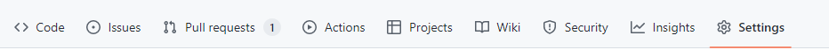
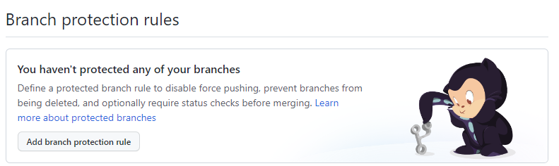
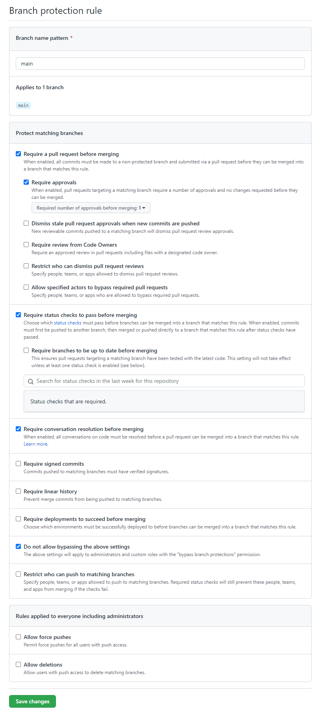

# Plotly dashboard template
A template repository for creating data dashboards with Plotly.

**This is a template, and should not be overwritten.** There are instructions below on how to set up your own development repository.

## Getting started

### Creating a copy of the template

1. Choose a name for the repository to house your code. Please note this name should conform to [snake case (e.g. example_data_dashboard)](https://betterprogramming.pub/string-case-styles-camel-pascal-snake-and-kebab-case-981407998841) to avoid annoying errors later!
1. Create a new repository to house your dashboard from this template, instructions can be found [here](https://docs.github.com/en/repositories/creating-and-managing-repositories/creating-a-repository-from-a-template). **Do not overwrite this template repository.**
1. Update code with appropriate names everywhere `#UPDATE` and `# UPDATE` can be found in template. 

### Configuring GitHub policies
By default, GitHub  does not apply any branch protection policies to newly created repositories. We use these policies to enforce things like: Requiring pull requests to commit changes into the main branch, requiring any comments on pull requests to be resolved and requiring status checks to pass before pull requests can be merged.

1. Open the Settings menu for your GitHub repository ***(Your user needs to be assigned the Admin role to see this option. If it's missing contact your GitHub owner for permission)***

    

1. Click the Add branch protection rule button
    
    

1. Set the options in the below screenshot
    
    


### Installation
## Getting Started

### Set up your local development environment (DLUHC set up - others may vary)
**Note: This section only needs completing once**
1.  Set your default browser to Google Chrome - [instructions][Make Chrome your default browser].
1.  Open Anaconda Navigator via Start menu. **Note:** Anaconda asks if you want to update it, but it won't work.
1.  Install and launch VS Code (Visual Studio Code) from within the Anaconda Navigator. **Note** after installing VS Code, a Getting Started walkthrough is shown. Click the back button to escape.
1.  Navigate to the `Git CMD` from the start menu and execute the below commands. Once you have executed the commands close `Git CMD`.

    **Note: You need to change the name/email to match your own and you need to include the quotation marks. You may like to copy the commands into a word document to edit them.**

```shell
git config --global user.name "Your Name"
git config --global user.email "Your.Name@levellingup.gov.uk"
``` 

[Make Chrome your default browser]: https://support.google.com/chrome/answer/95417?hl=en-GB&co=GENIE.Platform%3DDesktop

### Downloading the code from GitHub

1.  Create a folder on your desktop, for storing source code within if you don't have one already.
1.  From VS Code open the [Explorer window][explorer_window], the overlapping pages icon on left hand menu. Select the option to "Clone Repository". Click "Clone from GitHub"
1.  If prompted, authorize with GitHub.
1.  You should be prompted to enter a repository name. Type "communitiesuk/&lt;Your repository name&gt;". Then click on communitiesuk/&lt;Your repository name&gt;.
1.  As a destination, select your folder for storing the source code. Select "Sign in with browser" if the GitHub authorisation popup is shown.
1.  This pulls the code from GitHub to your local folder.
    Click "Open folder" option, and navigate to your newly created folder containing the repository code.
1.  Select "Yes, I trust the authors".

[explorer_window]: https://code.visualstudio.com/docs/getstarted/userinterface#_explorer

### Installing packages

1.  [Open a command prompt terminal within VS Code][open-terminal], in which you'll start executing some commands. By default, the initial terminal will be a powershell terminal, and you will need to [switch to a command prompt shell][terminal-switch]. 
1.  Update the name field in environment.yml to the dashboard name
1.  Create a new conda environment by typing `conda env create -f environment.yml` into the terminal and executing the command by pressing the Enter key.
1.  Activate your conda environment with `conda activate <dashboard name> `
1. Close VS Code. Open Anaconda Navigator, select "&lt; Dashboard name &gt;" for the 'Application on' drop down menu, then select "Launch" VS Code. Click the bin icon on the terminal toolbar to close the terminal. Click the plus icon on the terminal toolbar to launch a new terminal.
1.  Install the [Microsoft Python][python_extension] extension for VS Code.
1.  Follow the [instructions for configuring the Python interpreter][configure_python_interpreter].


[open-terminal]: https://code.visualstudio.com/docs/editor/integrated-terminal
[terminal-switch]: https://code.visualstudio.com/docs/editor/integrated-terminal#_terminal-shells
[python_extension]: https://marketplace.visualstudio.com/items?itemName=ms-python.python
[configure_python_interpreter]: https://code.visualstudio.com/docs/python/python-tutorial#_select-a-python-interpreter

### Configuring GitHub triggers

1. Navigate to `check-before-merging.yml` in the workflows folder
1. Uncomment the GitHub triggers for the Automated checks
1. Update the application-name environment variable to the application name, which should match the value set in the dashboard.

### Setting environment variables
1. From VS Code, open the `.env` file. If this file does not exist, then create it at the root of the project. The `.env` file is excluded from git commits, so can contain secrets such as AWS Access keys as they will only be present on an individual developer laptop
1. Inside the `.env file`, add the new environment variable in the format `ENVIRONMENT_VARIABLE=VALUE`. An example is `STAGE="production"`. There is a file called `.env.example` that be used for reference


### Running the application
1.  From your VS Code terminal, execute `python run.py`
1.  Wait for the message "Dash is running on ..." message to appear
1.  Navigate to http://localhost:8080/ in your browser within the AWS workspace. Note that http://localhost:8080/ is the address that dash will run on in your local machine.
1. Use Ctrl-C in the terminal to quit the python server. 

    **Note:** Terminal can only handle one command at a time, if the python server is running the terminal will not handle any further commands. To restart the server use `python run.py`

### Github Action workflows
The `.github` folder contains a range of workflows that may be useful in a new project. They will need updating to run correctly within Github. The files should be deleted if the specific workflow is not desired. 
- `after-merging.yml` can be used to run accessibility checks on the dashboard via [Cypress](https://docs.cypress.io/guides/overview/why-cypress). This requires a [Github secret](https://docs.github.com/en/actions/security-guides/using-secrets-in-github-actions) to be set, `secrets.CYPRESS_BASE_URL`. 
- `attach-to-trello.yml` is used to attach information about a pull request to its relevant [Trello](https://trello.com) ticket. Trello key and token Github secrets are required for the Action to be able to connect to Trello. 
- `check-before-merging.yml` runs the Python formatter, linter and tests on each pull request. It is advised that Github is configured so that PRs can't be merged unless these pass.
- `dependabot-pr-merge.yml` approves and merges PRs created by dependabot that are minor or patch changes to the current version of a package specified in `requirements.txt`. 

# Access and update data and text
## Locally

If you want to refresh any data files or text files for development purposes, run the refresh_local.py file that will by default replace all local data files with the latest from CDS, but will not replace local text files. 

Command line arguments can be passed in to alter the default behaviour: `--force_data_refresh <True|False>` and `--force_text_refresh <True|False>`

This command will NOT push any changes into blob storage, it will only refresh the local files.

## Blob
### Prerequisites:

Create a .env file in the root directory of your project. Copy the contents of the .env.example file into the .env file and update variables accordingly

### To update the data in blob storage accounts:

In order to push files to blob storage, files will need to exist locally. A refresh of this data can be done at the point of running the ```pr_actions.py```. 
The script uses the ```data_query_classes.py``` list of queries to update local data files, and then run integration and data tests against the data. Only if all the tests pass are updated files uploaded to the dev, tst and prd blob storage accounts. Each local file will be read into the script and have a hashing function applied to it to generate a unique code for the content of the file, which is compared to the hash of the data file in the blob - if these are different the data file is uploaded with a new version.
Once the files have been uploaded, a json file ```mapping.json``` for use in Azure is created to create a mapping between the file and where it exists in the blob container. This json file is used when getting a data file from the blob container. Finally the script will ask for Sentry version and Devops message, to allow for automated deployment to Azure once merged to GitHub main branch.

```bash
python pr_actions.py
```

### Automated data updates to blob storage accounts:

At 9:30am `cds_to_all_blobs_azure.bat` is ran as part of the data engineer's end to end data update process. This checks out the code deployed to each Azure environment (dev, tst and prd), and refreshes the data, and if data and integration tests pass the new data is uploaded to the environment's blob, with the name matching what is in the ```mapping.json``` - this new version has the same filename as the previous version but relates to the versions stored within the blob. All `get_data` functions are decorated with `@track_cache`, and if a newer version of data exists in the blob since it was last accessed, it clears the cache so new data is displayed on the front end.

### Further information

Go to the [Plotly Dashboards wiki - Storing and retrieving data from blob storage](https://github.com/communitiesuk/plotly_dashboard_docs/wiki/Deployment-to-D4I#storing-and-retrieving-data-from-blob-storage) section.


## Development

### Running tests

Writing and running automated tests ensures software is correct, reduces risk that users will experience bugs, and allows developers to move much faster as they can make changes with confidence that any breaks will be caught be the test suite. Once you have set up unit tests:

```bash
python -u -m pytest tests
```

### Running the code formatter

The [code formatter](https://black.readthedocs.io/en/stable/) ensures source code is formatted consistently. Running the code formatter makes changes automatically that then need to be committed.

```bash
black ./
```

### Running the linter

The linter checks for basic logic errors and bugs. Linting reports rule violations that must be corrected manually.  

```bash
pylint <Dashboard name>
```

## Deployment to azure

Once set up, deployment to Azure is triggered by changes to the `Deployment_Run.txt` file in the devops folder which occur when running `python pr_actions.py`.

### Setting up automatic Azure deployment

Uncomment lines 7-13 in `.github/workflows/Azure_Devops.yml`.

## Tests

The Dash tests within the /tests/dashboards folder have their own data files
stored within /tests/data.

To view the dashboard using that data, run the dashboard using `python run.py --test-data`.

### Test Coverage
Python has tools that allow us to check how much of our codebase is covered with tests. The tool we use is called [Coverage](https://coverage.readthedocs.io/en/6.4.3/) that provides both an analysis of our code coverage levels, and produces a html page to allow easy viewing of the results. 
When running the code coverage tools, we want to exclude any tests in the dashboards folder. These tests start the app using an in-memory server and so can skew the code coverage results 

This can be checked locally by running the below commands in order
- `coverage run -m pytest --headless tests/unit`
- `coverage html`
 
A large number of files will be created in the `htmlcov` folder, opening the `index.html` file will provide the summary of the code coverage results. Each file can be viewed in more detail to see what sections of that file are missing associated unit test cases.  

### Visual regression testing
We use a combination of [playwright](https://playwright.dev/python/) and [pixelmatch](https://github.com/mapbox/pixelmatch) for ensuring we haven't introduced any bugs in our dashboards. Playwright is used to generate a screenshot of a dashboard and save it to .png file, then pixelmatch takes over and does a pixel by pixel comparison to check if there are any differences between the current version of the dashboard and the previous version.

We currently only run the visual regression tests in Github Actions, as we found that the tests did not run reliably on Windows machines. For cases where you still wish to run the tests locally, see the 'Running the visual tests locally' section below.

#### Process for updating snapshots
The saved snapshots are automatically updated when there are modifications to the visuals of the dashboards.

The recommended process for checking changes to the snapshots is as follows:
1. Create a PR as you would usually.
1. If there are visual changes, a comment will be posted on the PR saying that the snapshots have been updated but warning to check that there are only expected changes.
1. Go to the summary of the Github Action by clicking the link in the comment.
1. Download the failed snapshots by opening the `snapshots_failure` folder in the Artifacts section at the bottom of the Github Action summary.
1. For each test in the snapshots_failure folder, view the `actual.png` (the new version), `expected.png` (previous version of snapshot) and `diff.png` (the difference between the two snapshots).
1. If there are unexpected changes, you will need to pull down the new snapshots pushed to the branch before you make more commits. 
1. If you are happy with the changes, you need to pull down the changes locally and then run the following commands in your terminal:
    - ```git commit --allow-empty -m "Trigger Build"```
    - ```git push```<br>
    This will run the checks again to allow the PR to be merged (this is needed as although the Action pushes changes to the branch, it does not force a new workflow run).
            
#### Running the visual tests locally
**Warning:** Tests will fail locally when comparing to snapshots generated in Github Actions.  

While the tests do not run reliably on Windows machines, running them locally may be useful for setting up the folder structure when creating new tests or for debugging purposes. 

To run the tests locally, your conda environment will need to be up to date and the first time you will need to run the command `playwright install` to install the chromium headless runner. Once this command has been run, ensure you restart the DAP environment.

To run the visual tests, run the command:
- `python -u -m pytest --headless tests/visual`

To update the snapshots, run the command:
- `python -u -m pytest --headless --update-snapshots tests/visual`

This will generate new `expected.png` images in the `visual/snapshots` folder. Note - while running tests with these snapshots may pass, they will fail in Github Actions due to differences in environments.

You can also add the `--fail-fast` flag when running the tests, this causes a test to fail immediately on finding a pixel mismatch, instead of comparing the entire page and highlighting all pixel differences. The downside of using this flag is that the diff image only displays up to the first difference between the pages.

#### Accessibility checklist 

When creating accessible code, it is important to consider accessibility guidelines and standards, such as the Web Content Accessibility Guidelines (WCAG) 2.1.  

Some key aspects to keep in mind include: 

Alternative text: Providing descriptive alternative text for images and other non-text content to make it accessible to screen readers. 

Semantic HTML: Use appropriate HTML elements, such as headings, lists, and tables, to convey meaning. For example it is recommended to use ordered lists or unordered lists rather than list items for accessibility because they provide a semantic structure to the content and make it easier for assistive technologies to understand and interpret. 

Keyboard navigation: Ensure that all functionality on the page can be operated using only the keyboard. 

Screen reader compatibility: Making sure that screen readers can access and interpret the page correctly. 

Colour contrast: Using sufficient colour contrast between text and background to make the content legible for users with low vision. 